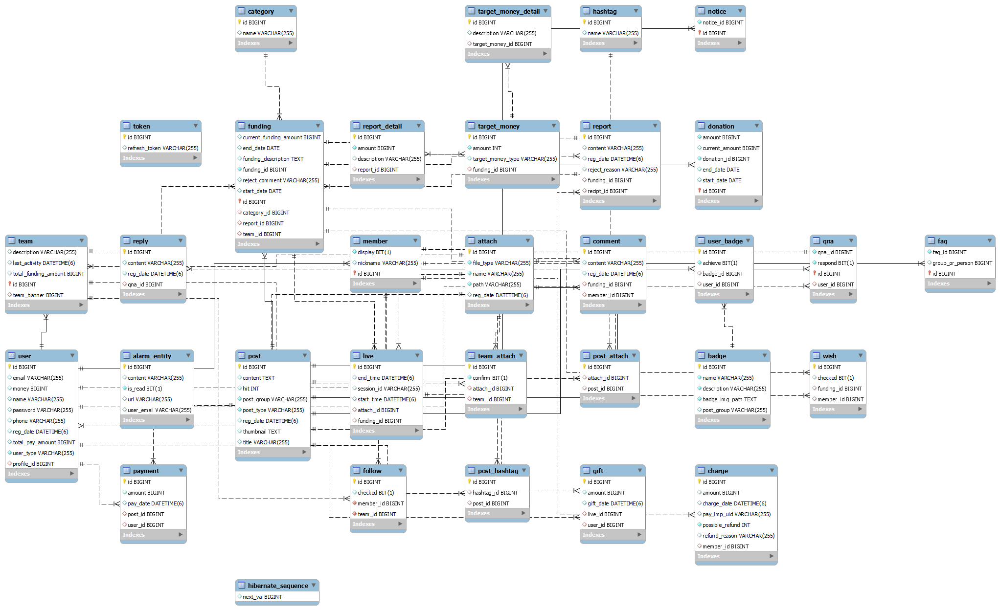
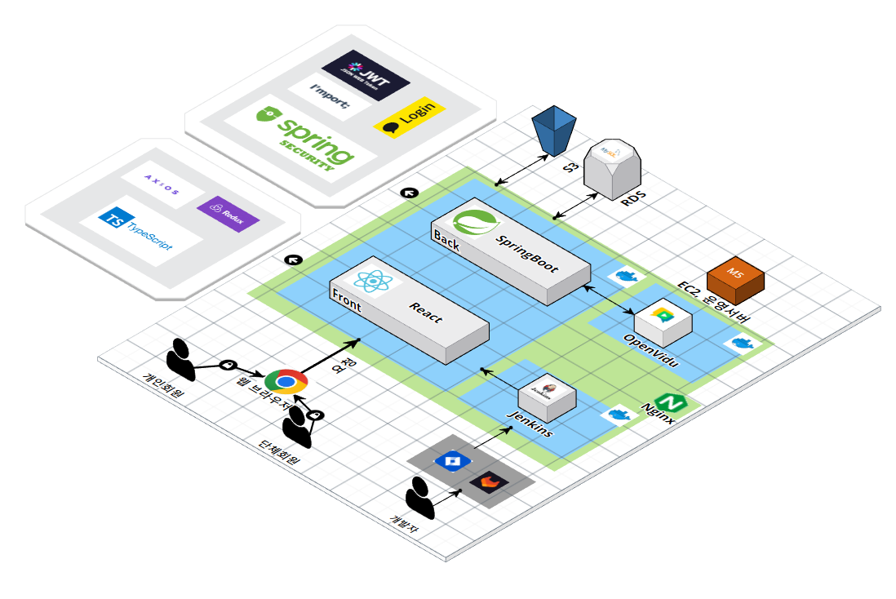

# <span style="color:orange"> FUNTEER </span>

## - 기부형 크라우드 펀딩을 통한 봉사활동 중개 플랫폼


<br>
<br>

## 목차

- [FUNTEER](#FUNTEER)
  - [목차](#목차)
  - [서비스 소개](#서비스-소개)
  - [기술 스택 및 버전](#기술-스택-및-버전)
  - [프로젝트 아키텍쳐](#프로젝트-아키텍쳐)
  - [산출물](#산출물)
  - [결과물](#결과물)
  - [프로젝트 파일 구조](#프로젝트-파일-구조)

<br>
<br>

## 서비스 소개

1. 개발 기간 : 2023.01.09 ~ 2023.02.17 (총 6주)
2. 인원 (총 6인)

<table>
  <tr>
   <td align="center"><a href="https://github.com/bbookng">
   <br /><sub><b>bbookng</b><br></sub></a>
    <sub><b>팀장, BE</b><br></sub></td>
   <td align="center"><a href="https://github.com/">
   <br /><sub><b>김송빈</b><br></sub></a>
   <sub><b>BE</b><br></sub></td>
   <td align="center"><a href="https://github.com/ddings7303">
   <br /><sub><b>ddings73</b><br></sub></a>
    <sub><b>BE</b><br></sub></td>
   <td align="center"><a href="https://github.com/bangbongbim">
   <br /><sub><b>bangbongbim</b><br></sub></a>
   <sub><b>FE</b><br></sub></td>
   <td align="center"><a href="https://github.com/">
   <br /><sub><b>김승섭</b><br></sub></a>
       <sub><b>FE</b><br></sub></td>
   <td align="center"><a href="https://github.com/becoding96">
   <br /><sub><b>becoding96</b><br></sub></a>
      <sub><b>FE</b><br></sub></td>
  </tr>
</table>

<br>

### 📌 개요

- 서비스 목표 : **기부형 크라우드 펀딩**을 통한 개인의 기부 참여 독려, 봉사 단체 활성화
- 기획 배경
  - 기부자 측면의 문제점
    - 기부 단체에 대한 신뢰 부족
    - 기부 단체 또는 방법에 대한 정보 부족
    - 공간적, 시간적 제한으로 인한 참여
  - 봉사 단체 측면의 문제점
    - 자선 활동 예산 부족
- 기대 효과 (서비스 목표 상세)
  - 봉사활동 라이브 중계를 통하여 봉사 단체, 기부에 대한 투명성과 신뢰성을 보장
  - 펀딩 참여자에게는 만족감을 불러 일으키고, 봉사 단체에게는 자금을 전달하여 기부와 봉사를 활성화
  - 플랫폼을 통해 기부와 봉사에 대한 정보를 제공해 접근성 증대

<br>

### 📌 서비스 화면

넣 어 줘 !

<br>
<br>

## 기술 스택 및 버전

1. 이슈 관리 : 

2. 형상 관리: 

3. 커뮤니케이션:  

4. 개발 환경

   - IDE : 2022.3.1 1.75.1
   - DB :  8.0.32
   - UI & UX : 
   - Server :    

5. 상세

   - Backend :  11.0.17 2.7.7 6.8.3 0.11.2

   - Frontend : 

      18.2.0  18.0.27

   - CI/CD : 20.10.23  2.375.2

   - WebRTC :  2.25.0

<br>
<br>

## 프로젝트 아키텍쳐

#### 📌 아키텍쳐 - ERD



<br>

#### 📌 서비스 아키텍쳐



<br>
<br>

## 산출물

- [프로젝트 관리 : Notion](https://orchid-yarrow-bec.notion.site/2-b0c54b7b536e463fb159d48d76b3c5b4)

- [기획서](https://www.notion.so/7071e837b059473eaa53a8ac00f53d65?pvs=4)
- [API Docs](https://www.notion.so/API-Docs-a7fa3a03be664de6a6ac88c3dfe98aca?pvs=4)
- [기능명세서](https://www.notion.so/f44fff9bf9bf49ada13e134660e6a759?v=0c87ae28262d46738f35089c0fa6050a&pvs=4)
- [와이어프레임](https://www.figma.com/file/tvcb2DWNgUQYmNkuIQmkER/FUNTEER_wireframe)
- [Git Convention](https://www.notion.so/Git-Convention-f23951645a804c66a0dfc34b2c3f9033?pvs=4)

<br>
<br>

## 결과물

- [포팅메뉴얼](./exec/포팅 매뉴얼.md)

- [시연시나리오](./exec/시연.pptx)
- [최종발표자료](./exec/funteer_최종ppt.pdf)

<br>
<br>

## 프로젝트 파일 구조

- **Backend**

```
📦main
 ┣ 📂java
 ┃ ┗ 📂com
 ┃ ┃ ┗ 📂yam
 ┃ ┃ ┃ ┗ 📂funteer
 ┃ ┃ ┃ ┃ ┣ 📂admin
 ┃ ┃ ┃ ┃ ┃ ┣ 📂controller
 ┃ ┃ ┃ ┃ ┃ ┃ ┗ 📜AdminController.java
 ┃ ┃ ┃ ┃ ┃ ┣ 📂dto
 ┃ ┃ ┃ ┃ ┃ ┃ ┣ 📜MemberListResponse.java
 ┃ ┃ ┃ ┃ ┃ ┃ ┣ 📜TeamConfirmRequest.java
 ┃ ┃ ┃ ┃ ┃ ┃ ┗ 📜TeamListResponse.java
 ┃ ┃ ┃ ┃ ┃ ┗ 📂service
 ┃ ┃ ┃ ┃ ┃ ┃ ┣ 📜AdminService.java
 ┃ ┃ ┃ ┃ ┃ ┃ ┗ 📜AdminServiceImpl.java
 ┃ ┃ ┃ ┃ ┣ 📂alarm
 ┃ ┃ ┃ ┃ ┃ ┣ 📂controller
 ┃ ┃ ┃ ┃ ┃ ┃ ┗ 📜AlarmController.java
 ┃ ┃ ┃ ┃ ┃ ┣ 📂dto
 ┃ ┃ ┃ ┃ ┃ ┃ ┗ 📂response
 ┃ ┃ ┃ ┃ ┃ ┃ ┃ ┗ 📜PastAlarmListRes.java
 ┃ ┃ ┃ ┃ ┃ ┣ 📂entity
 ┃ ┃ ┃ ┃ ┃ ┃ ┣ 📜Alarm.java
 ┃ ┃ ┃ ┃ ┃ ┃ ┗ 📜AlarmEntity.java
 ┃ ┃ ┃ ┃ ┃ ┣ 📂repository
 ┃ ┃ ┃ ┃ ┃ ┃ ┣ 📜AlarmEntityRepository.java
 ┃ ┃ ┃ ┃ ┃ ┃ ┣ 📜AlarmRepository.java
 ┃ ┃ ┃ ┃ ┃ ┃ ┗ 📜AlarmRepositoryImpl.java
 ┃ ┃ ┃ ┃ ┃ ┗ 📂service
 ┃ ┃ ┃ ┃ ┃ ┃ ┗ 📜AlarmService.java
 ┃ ┃ ┃ ┃ ┣ 📂attach
 ┃ ┃ ┃ ┃ ┃ ┣ 📂entity
 ┃ ┃ ┃ ┃ ┃ ┃ ┣ 📜Attach.java
 ┃ ┃ ┃ ┃ ┃ ┃ ┣ 📜PostAttach.java
 ┃ ┃ ┃ ┃ ┃ ┃ ┗ 📜TeamAttach.java
 ┃ ┃ ┃ ┃ ┃ ┣ 📂repository
 ┃ ┃ ┃ ┃ ┃ ┃ ┣ 📜AttachRepository.java
 ┃ ┃ ┃ ┃ ┃ ┃ ┣ 📜PostAttachRepository.java
 ┃ ┃ ┃ ┃ ┃ ┃ ┗ 📜TeamAttachRepository.java
 ┃ ┃ ┃ ┃ ┃ ┣ 📜FileType.java
 ┃ ┃ ┃ ┃ ┃ ┗ 📜FileUtil.java
 ┃ ┃ ┃ ┃ ┣ 📂badge
 ┃ ┃ ┃ ┃ ┃ ┣ 📂dto
 ┃ ┃ ┃ ┃ ┃ ┃ ┣ 📂reponse
 ┃ ┃ ┃ ┃ ┃ ┃ ┃ ┗ 📜BadgeBaseRes.java
 ┃ ┃ ┃ ┃ ┃ ┃ ┗ 📂request
 ┃ ┃ ┃ ┃ ┃ ┃ ┃ ┗ 📜BadgeRegisterReq.java
 ┃ ┃ ┃ ┃ ┃ ┣ 📂entity
 ┃ ┃ ┃ ┃ ┃ ┃ ┗ 📜Badge.java
 ┃ ┃ ┃ ┃ ┃ ┣ 📂repository
 ┃ ┃ ┃ ┃ ┃ ┃ ┗ 📜BadgeRepository.java
 ┃ ┃ ┃ ┃ ┃ ┗ 📂service
 ┃ ┃ ┃ ┃ ┃ ┃ ┣ 📜BadgeService.java
 ┃ ┃ ┃ ┃ ┃ ┃ ┗ 📜BadgeServiceImpl.java
 ┃ ┃ ┃ ┃ ┣ 📂common
 ┃ ┃ ┃ ┃ ┃ ┣ 📂aws
 ┃ ┃ ┃ ┃ ┃ ┃ ┣ 📜AwsS3Uploader.java
 ┃ ┃ ┃ ┃ ┃ ┃ ┣ 📜S3Controller.java
 ┃ ┃ ┃ ┃ ┃ ┃ ┗ 📜S3Service.java
 ┃ ┃ ┃ ┃ ┃ ┣ 📂code
 ┃ ┃ ┃ ┃ ┃ ┃ ┣ 📜PostGroup.java
 ┃ ┃ ┃ ┃ ┃ ┃ ┣ 📜PostType.java
 ┃ ┃ ┃ ┃ ┃ ┃ ┣ 📜TargetMoneyType.java
 ┃ ┃ ┃ ┃ ┃ ┃ ┣ 📜TypeController.java
 ┃ ┃ ┃ ┃ ┃ ┃ ┣ 📜TypeModel.java
 ┃ ┃ ┃ ┃ ┃ ┃ ┣ 📜TypeValue.java
 ┃ ┃ ┃ ┃ ┃ ┃ ┗ 📜UserType.java
 ┃ ┃ ┃ ┃ ┃ ┣ 📂config
 ┃ ┃ ┃ ┃ ┃ ┃ ┣ 📜AwsS3Config.java
 ┃ ┃ ┃ ┃ ┃ ┃ ┣ 📜EmailConfig.java
 ┃ ┃ ┃ ┃ ┃ ┃ ┣ 📜MvcConfig.java
 ┃ ┃ ┃ ┃ ┃ ┃ ┣ 📜SecurityConfig.java
 ┃ ┃ ┃ ┃ ┃ ┃ ┗ 📜SwaggerConfig.java
 ┃ ┃ ┃ ┃ ┃ ┣ 📂security
 ┃ ┃ ┃ ┃ ┃ ┃ ┣ 📂filter
 ┃ ┃ ┃ ┃ ┃ ┃ ┃ ┣ 📜JwtAuthFilter.java
 ┃ ┃ ┃ ┃ ┃ ┃ ┃ ┗ 📜JwtExceptionFilter.java
 ┃ ┃ ┃ ┃ ┃ ┃ ┣ 📂handler
 ┃ ┃ ┃ ┃ ┃ ┃ ┃ ┣ 📜JwtAccessDeniedHandler.java
 ┃ ┃ ┃ ┃ ┃ ┃ ┃ ┗ 📜OAuth2SuccessHandler.java
 ┃ ┃ ┃ ┃ ┃ ┃ ┣ 📂service
 ┃ ┃ ┃ ┃ ┃ ┃ ┃ ┣ 📜CustomOAuth2UserService.java
 ┃ ┃ ┃ ┃ ┃ ┃ ┃ ┣ 📜CustomUserDetailsService.java
 ┃ ┃ ┃ ┃ ┃ ┃ ┃ ┗ 📜OAuth2Attribute.java
 ┃ ┃ ┃ ┃ ┃ ┃ ┣ 📜JwtAuthenticationEntryPoint.java
 ┃ ┃ ┃ ┃ ┃ ┃ ┣ 📜JwtProvider.java
 ┃ ┃ ┃ ┃ ┃ ┃ ┗ 📜SecurityUtil.java
 ┃ ┃ ┃ ┃ ┃ ┣ 📜BaseResponseBody.java
 ┃ ┃ ┃ ┃ ┃ ┣ 📜MyPageable.java
 ┃ ┃ ┃ ┃ ┃ ┗ 📜StringToFundingReportDetailRequestConverter.java
 ┃ ┃ ┃ ┃ ┣ 📂donation
 ┃ ┃ ┃ ┃ ┃ ┣ 📂controller
 ┃ ┃ ┃ ┃ ┃ ┃ ┗ 📜DonationController.java
 ┃ ┃ ┃ ┃ ┃ ┣ 📂dto
 ┃ ┃ ┃ ┃ ┃ ┃ ┣ 📂request
 ┃ ┃ ┃ ┃ ┃ ┃ ┃ ┣ 📜DonationJoinReq.java
 ┃ ┃ ┃ ┃ ┃ ┃ ┃ ┣ 📜DonationModifyReq.java
 ┃ ┃ ┃ ┃ ┃ ┃ ┃ ┣ 📜DonationRegisterReq.java
 ┃ ┃ ┃ ┃ ┃ ┃ ┃ ┗ 📜DonationStatusModify.java
 ┃ ┃ ┃ ┃ ┃ ┃ ┗ 📂response
 ┃ ┃ ┃ ┃ ┃ ┃ ┃ ┣ 📜DonationAdminListRes.java
 ┃ ┃ ┃ ┃ ┃ ┃ ┃ ┣ 📜DonationBaseRes.java
 ┃ ┃ ┃ ┃ ┃ ┃ ┃ ┣ 📜DonationJoinUserRes.java
 ┃ ┃ ┃ ┃ ┃ ┃ ┃ ┗ 📜DonationListRes.java
 ┃ ┃ ┃ ┃ ┃ ┣ 📂entity
 ┃ ┃ ┃ ┃ ┃ ┃ ┗ 📜Donation.java
 ┃ ┃ ┃ ┃ ┃ ┣ 📂exception
 ┃ ┃ ┃ ┃ ┃ ┃ ┣ 📂handler
 ┃ ┃ ┃ ┃ ┃ ┃ ┃ ┗ 📜DonationExceptionHandler.java
 ┃ ┃ ┃ ┃ ┃ ┃ ┣ 📜DonationNotFoundException.java
 ┃ ┃ ┃ ┃ ┃ ┃ ┗ 📜DonationPayException.java
 ┃ ┃ ┃ ┃ ┃ ┣ 📂repository
 ┃ ┃ ┃ ┃ ┃ ┃ ┗ 📜DonationRepository.java
 ┃ ┃ ┃ ┃ ┃ ┗ 📂service
 ┃ ┃ ┃ ┃ ┃ ┃ ┣ 📜DonationService.java
 ┃ ┃ ┃ ┃ ┃ ┃ ┗ 📜DonationServiceImpl.java
 ┃ ┃ ┃ ┃ ┣ 📂exception
 ┃ ┃ ┃ ┃ ┃ ┣ 📂handler
 ┃ ┃ ┃ ┃ ┃ ┃ ┣ 📜FundingExceptionHandler.java
 ┃ ┃ ┃ ┃ ┃ ┃ ┣ 📜LiveExceptionHandler.java
 ┃ ┃ ┃ ┃ ┃ ┃ ┗ 📜UserExceptionHandler.java
 ┃ ┃ ┃ ┃ ┃ ┣ 📜DuplicateInfoException.java
 ┃ ┃ ┃ ┃ ┃ ┣ 📜SessionNotFoundException.java
 ┃ ┃ ┃ ┃ ┃ ┗ 📜UserNotFoundException.java
 ┃ ┃ ┃ ┃ ┣ 📂faq
 ┃ ┃ ┃ ┃ ┃ ┣ 📂controller
 ┃ ┃ ┃ ┃ ┃ ┃ ┗ 📜FaqController.java
 ┃ ┃ ┃ ┃ ┃ ┣ 📂dto
 ┃ ┃ ┃ ┃ ┃ ┃ ┣ 📂request
 ┃ ┃ ┃ ┃ ┃ ┃ ┃ ┗ 📜FaqRegisterReq.java
 ┃ ┃ ┃ ┃ ┃ ┃ ┗ 📂response
 ┃ ┃ ┃ ┃ ┃ ┃ ┃ ┣ 📜FaqBaseRes.java
 ┃ ┃ ┃ ┃ ┃ ┃ ┃ ┗ 📜FaqListRes.java
 ┃ ┃ ┃ ┃ ┃ ┣ 📂entity
 ┃ ┃ ┃ ┃ ┃ ┃ ┗ 📜Faq.java
 ┃ ┃ ┃ ┃ ┃ ┣ 📂exception
 ┃ ┃ ┃ ┃ ┃ ┃ ┣ 📂handler
 ┃ ┃ ┃ ┃ ┃ ┃ ┃ ┗ 📜FaqExceptionHandler.java
 ┃ ┃ ┃ ┃ ┃ ┃ ┗ 📜FaqNotFoundException.java
 ┃ ┃ ┃ ┃ ┃ ┣ 📂repository
 ┃ ┃ ┃ ┃ ┃ ┃ ┗ 📜FaqRepository.java
 ┃ ┃ ┃ ┃ ┃ ┗ 📂service
 ┃ ┃ ┃ ┃ ┃ ┃ ┣ 📜FaqService.java
 ┃ ┃ ┃ ┃ ┃ ┃ ┗ 📜FaqServiceImpl.java
 ┃ ┃ ┃ ┃ ┣ 📂funding
 ┃ ┃ ┃ ┃ ┃ ┣ 📂controller
 ┃ ┃ ┃ ┃ ┃ ┃ ┗ 📜FundingController.java
 ┃ ┃ ┃ ┃ ┃ ┣ 📂dto
 ┃ ┃ ┃ ┃ ┃ ┃ ┣ 📂request
 ┃ ┃ ┃ ┃ ┃ ┃ ┃ ┣ 📜FundingCommentRequest.java
 ┃ ┃ ┃ ┃ ┃ ┃ ┃ ┣ 📜FundingReportDetailRequest.java
 ┃ ┃ ┃ ┃ ┃ ┃ ┃ ┣ 📜FundingReportRequest.java
 ┃ ┃ ┃ ┃ ┃ ┃ ┃ ┣ 📜FundingRequest.java
 ┃ ┃ ┃ ┃ ┃ ┃ ┃ ┣ 📜RejectReasonRequest.java
 ┃ ┃ ┃ ┃ ┃ ┃ ┃ ┣ 📜ReportDetailRequest.java
 ┃ ┃ ┃ ┃ ┃ ┃ ┃ ┣ 📜TakeFundingRequest.java
 ┃ ┃ ┃ ┃ ┃ ┃ ┃ ┣ 📜TargetMoneyDetailRequest.java
 ┃ ┃ ┃ ┃ ┃ ┃ ┃ ┗ 📜TargetMoneyRequest.java
 ┃ ┃ ┃ ┃ ┃ ┃ ┗ 📂response
 ┃ ┃ ┃ ┃ ┃ ┃ ┃ ┣ 📜CommentResponse.java
 ┃ ┃ ┃ ┃ ┃ ┃ ┃ ┣ 📜FundingDetailResponse.java
 ┃ ┃ ┃ ┃ ┃ ┃ ┃ ┣ 📜FundingListPageResponse.java
 ┃ ┃ ┃ ┃ ┃ ┃ ┃ ┣ 📜FundingListResponse.java
 ┃ ┃ ┃ ┃ ┃ ┃ ┃ ┣ 📜FundingReportResponse.java
 ┃ ┃ ┃ ┃ ┃ ┃ ┃ ┣ 📜HashtagResponse.java
 ┃ ┃ ┃ ┃ ┃ ┃ ┃ ┣ 📜ReportDetailResponse.java
 ┃ ┃ ┃ ┃ ┃ ┃ ┃ ┣ 📜TargetMoneyDetailResponse.java
 ┃ ┃ ┃ ┃ ┃ ┃ ┃ ┗ 📜TargetMoneyResponse.java
 ┃ ┃ ┃ ┃ ┃ ┣ 📂entity
 ┃ ┃ ┃ ┃ ┃ ┃ ┣ 📜Category.java
 ┃ ┃ ┃ ┃ ┃ ┃ ┣ 📜Funding.java
 ┃ ┃ ┃ ┃ ┃ ┃ ┣ 📜Report.java
 ┃ ┃ ┃ ┃ ┃ ┃ ┣ 📜ReportDetail.java
 ┃ ┃ ┃ ┃ ┃ ┃ ┣ 📜TargetMoney.java
 ┃ ┃ ┃ ┃ ┃ ┃ ┗ 📜TargetMoneyDetail.java
 ┃ ┃ ┃ ┃ ┃ ┣ 📂exception
 ┃ ┃ ┃ ┃ ┃ ┃ ┣ 📜CategoryNotFoundException.java
 ┃ ┃ ┃ ┃ ┃ ┃ ┣ 📜CommentNotFoundException.java
 ┃ ┃ ┃ ┃ ┃ ┃ ┣ 📜FundingNotFoundException.java
 ┃ ┃ ┃ ┃ ┃ ┃ ┣ 📜InsufficientBalanceException.java
 ┃ ┃ ┃ ┃ ┃ ┃ ┣ 📜NotAuthenticatedMemberException.java
 ┃ ┃ ┃ ┃ ┃ ┃ ┣ 📜NotAuthenticatedTeamException.java
 ┃ ┃ ┃ ┃ ┃ ┃ ┗ 📜NotFoundReportException.java
 ┃ ┃ ┃ ┃ ┃ ┣ 📂repository
 ┃ ┃ ┃ ┃ ┃ ┃ ┣ 📜FundingRepository.java
 ┃ ┃ ┃ ┃ ┃ ┃ ┣ 📜ReportDetailRepository.java
 ┃ ┃ ┃ ┃ ┃ ┃ ┣ 📜ReportRepository.java
 ┃ ┃ ┃ ┃ ┃ ┃ ┣ 📜TargetMoneyDetailRepository.java
 ┃ ┃ ┃ ┃ ┃ ┃ ┗ 📜TargetMoneyRepository.java
 ┃ ┃ ┃ ┃ ┃ ┗ 📂service
 ┃ ┃ ┃ ┃ ┃ ┃ ┣ 📜FundingService.java
 ┃ ┃ ┃ ┃ ┃ ┃ ┗ 📜FundingServiceImpl.java
 ┃ ┃ ┃ ┃ ┣ 📂live
 ┃ ┃ ┃ ┃ ┃ ┣ 📂controller
 ┃ ┃ ┃ ┃ ┃ ┃ ┗ 📜LiveController.java
 ┃ ┃ ┃ ┃ ┃ ┣ 📂dto
 ┃ ┃ ┃ ┃ ┃ ┃ ┣ 📜ActiveSessionsResponse.java
 ┃ ┃ ┃ ┃ ┃ ┃ ┣ 📜CreateConnectionRequest.java
 ┃ ┃ ┃ ┃ ┃ ┃ ┣ 📜CreateConnectionResponse.java
 ┃ ┃ ┃ ┃ ┃ ┃ ┣ 📜GiftRequest.java
 ┃ ┃ ┃ ┃ ┃ ┃ ┣ 📜SessionLeaveRequest.java
 ┃ ┃ ┃ ┃ ┃ ┃ ┗ 📜StartRecordingRequest.java
 ┃ ┃ ┃ ┃ ┃ ┣ 📂entity
 ┃ ┃ ┃ ┃ ┃ ┃ ┣ 📜Gift.java
 ┃ ┃ ┃ ┃ ┃ ┃ ┗ 📜Live.java
 ┃ ┃ ┃ ┃ ┃ ┣ 📂repository
 ┃ ┃ ┃ ┃ ┃ ┃ ┣ 📜GiftRepository.java
 ┃ ┃ ┃ ┃ ┃ ┃ ┗ 📜LiveRepository.java
 ┃ ┃ ┃ ┃ ┃ ┗ 📂service
 ┃ ┃ ┃ ┃ ┃ ┃ ┣ 📜LiveService.java
 ┃ ┃ ┃ ┃ ┃ ┃ ┗ 📜LiveServiceImpl.java
 ┃ ┃ ┃ ┃ ┣ 📂mail
 ┃ ┃ ┃ ┃ ┃ ┣ 📂controller
 ┃ ┃ ┃ ┃ ┃ ┃ ┗ 📜MailController.java
 ┃ ┃ ┃ ┃ ┃ ┣ 📂service
 ┃ ┃ ┃ ┃ ┃ ┃ ┣ 📜EmailService.java
 ┃ ┃ ┃ ┃ ┃ ┃ ┗ 📜EmailServiceImpl.java
 ┃ ┃ ┃ ┃ ┃ ┗ 📜CodeInfo.java
 ┃ ┃ ┃ ┃ ┣ 📂notice
 ┃ ┃ ┃ ┃ ┃ ┣ 📂controller
 ┃ ┃ ┃ ┃ ┃ ┃ ┗ 📜NoticeController.java
 ┃ ┃ ┃ ┃ ┃ ┣ 📂dto
 ┃ ┃ ┃ ┃ ┃ ┃ ┣ 📂request
 ┃ ┃ ┃ ┃ ┃ ┃ ┃ ┗ 📜NoticeRegistReq.java
 ┃ ┃ ┃ ┃ ┃ ┃ ┗ 📂response
 ┃ ┃ ┃ ┃ ┃ ┃ ┃ ┣ 📜NoticeBaseRes.java
 ┃ ┃ ┃ ┃ ┃ ┃ ┃ ┗ 📜NoticeListRes.java
 ┃ ┃ ┃ ┃ ┃ ┣ 📂entity
 ┃ ┃ ┃ ┃ ┃ ┃ ┗ 📜Notice.java
 ┃ ┃ ┃ ┃ ┃ ┣ 📂exception
 ┃ ┃ ┃ ┃ ┃ ┃ ┣ 📂handler
 ┃ ┃ ┃ ┃ ┃ ┃ ┃ ┗ 📜NoticeExceptionHandler.java
 ┃ ┃ ┃ ┃ ┃ ┃ ┗ 📜NoticeNotFoundException.java
 ┃ ┃ ┃ ┃ ┃ ┣ 📂repository
 ┃ ┃ ┃ ┃ ┃ ┃ ┗ 📜NoticeRepository.java
 ┃ ┃ ┃ ┃ ┃ ┗ 📂service
 ┃ ┃ ┃ ┃ ┃ ┃ ┣ 📜NoticeService.java
 ┃ ┃ ┃ ┃ ┃ ┃ ┗ 📜NoticeServiceImpl.java
 ┃ ┃ ┃ ┃ ┣ 📂pay
 ┃ ┃ ┃ ┃ ┃ ┣ 📂controller
 ┃ ┃ ┃ ┃ ┃ ┃ ┗ 📜PayController.java
 ┃ ┃ ┃ ┃ ┃ ┣ 📂dto
 ┃ ┃ ┃ ┃ ┃ ┃ ┗ 📜CancelRequest.java
 ┃ ┃ ┃ ┃ ┃ ┣ 📂entity
 ┃ ┃ ┃ ┃ ┃ ┃ ┗ 📜Payment.java
 ┃ ┃ ┃ ┃ ┃ ┣ 📂exception
 ┃ ┃ ┃ ┃ ┃ ┃ ┗ 📜ImpossibleRefundException.java
 ┃ ┃ ┃ ┃ ┃ ┣ 📂repository
 ┃ ┃ ┃ ┃ ┃ ┃ ┗ 📜PaymentRepository.java
 ┃ ┃ ┃ ┃ ┃ ┗ 📂service
 ┃ ┃ ┃ ┃ ┃ ┃ ┣ 📜PayService.java
 ┃ ┃ ┃ ┃ ┃ ┃ ┗ 📜PayServiceImpl.java
 ┃ ┃ ┃ ┃ ┣ 📂post
 ┃ ┃ ┃ ┃ ┃ ┣ 📂entity
 ┃ ┃ ┃ ┃ ┃ ┃ ┣ 📜Comment.java
 ┃ ┃ ┃ ┃ ┃ ┃ ┣ 📜Hashtag.java
 ┃ ┃ ┃ ┃ ┃ ┃ ┣ 📜Post.java
 ┃ ┃ ┃ ┃ ┃ ┃ ┗ 📜PostHashtag.java
 ┃ ┃ ┃ ┃ ┃ ┗ 📂repository
 ┃ ┃ ┃ ┃ ┃ ┃ ┣ 📜CategoryRepository.java
 ┃ ┃ ┃ ┃ ┃ ┃ ┣ 📜CommentRepository.java
 ┃ ┃ ┃ ┃ ┃ ┃ ┣ 📜HashTagRepository.java
 ┃ ┃ ┃ ┃ ┃ ┃ ┣ 📜PostHashtagRepository.java
 ┃ ┃ ┃ ┃ ┃ ┃ ┗ 📜PostRepository.java
 ┃ ┃ ┃ ┃ ┣ 📂qna
 ┃ ┃ ┃ ┃ ┃ ┣ 📂controller
 ┃ ┃ ┃ ┃ ┃ ┃ ┣ 📜QnaController.java
 ┃ ┃ ┃ ┃ ┃ ┃ ┗ 📜ReplyController.java
 ┃ ┃ ┃ ┃ ┃ ┣ 📂dto
 ┃ ┃ ┃ ┃ ┃ ┃ ┣ 📂request
 ┃ ┃ ┃ ┃ ┃ ┃ ┃ ┣ 📜QnaRegisterReq.java
 ┃ ┃ ┃ ┃ ┃ ┃ ┃ ┗ 📜QnaReplyReq.java
 ┃ ┃ ┃ ┃ ┃ ┃ ┗ 📂response
 ┃ ┃ ┃ ┃ ┃ ┃ ┃ ┣ 📜QnaBaseRes.java
 ┃ ┃ ┃ ┃ ┃ ┃ ┃ ┣ 📜QnaListRes.java
 ┃ ┃ ┃ ┃ ┃ ┃ ┃ ┗ 📜ReplyBaseRes.java
 ┃ ┃ ┃ ┃ ┃ ┣ 📂entity
 ┃ ┃ ┃ ┃ ┃ ┃ ┣ 📜Qna.java
 ┃ ┃ ┃ ┃ ┃ ┃ ┗ 📜Reply.java
 ┃ ┃ ┃ ┃ ┃ ┣ 📂exception
 ┃ ┃ ┃ ┃ ┃ ┃ ┣ 📂handler
 ┃ ┃ ┃ ┃ ┃ ┃ ┃ ┗ 📜QnaExceptionHandler.java
 ┃ ┃ ┃ ┃ ┃ ┃ ┣ 📜QnaNotFoundException.java
 ┃ ┃ ┃ ┃ ┃ ┃ ┣ 📜ReplyDuplicatedException.java
 ┃ ┃ ┃ ┃ ┃ ┃ ┗ 📜ReplyNotFoundException.java
 ┃ ┃ ┃ ┃ ┃ ┣ 📂repository
 ┃ ┃ ┃ ┃ ┃ ┃ ┣ 📜QnaRepository.java
 ┃ ┃ ┃ ┃ ┃ ┃ ┗ 📜ReplyRepository.java
 ┃ ┃ ┃ ┃ ┃ ┗ 📂service
 ┃ ┃ ┃ ┃ ┃ ┃ ┣ 📜QnaService.java
 ┃ ┃ ┃ ┃ ┃ ┃ ┣ 📜QnaServiceImpl.java
 ┃ ┃ ┃ ┃ ┃ ┃ ┣ 📜ReplyService.java
 ┃ ┃ ┃ ┃ ┃ ┃ ┗ 📜ReplyServiceImpl.java
 ┃ ┃ ┃ ┃ ┣ 📂user
 ┃ ┃ ┃ ┃ ┃ ┣ 📂controller
 ┃ ┃ ┃ ┃ ┃ ┃ ┣ 📜LoginController.java
 ┃ ┃ ┃ ┃ ┃ ┃ ┣ 📜MemberController.java
 ┃ ┃ ┃ ┃ ┃ ┃ ┣ 📜TeamController.java
 ┃ ┃ ┃ ┃ ┃ ┃ ┗ 📜UserController.java
 ┃ ┃ ┃ ┃ ┃ ┣ 📂dto
 ┃ ┃ ┃ ┃ ┃ ┃ ┣ 📂request
 ┃ ┃ ┃ ┃ ┃ ┃ ┃ ┣ 📂member
 ┃ ┃ ┃ ┃ ┃ ┃ ┃ ┃ ┣ 📜ChargeRequest.java
 ┃ ┃ ┃ ┃ ┃ ┃ ┃ ┃ ┣ 📜CreateMemberRequest.java
 ┃ ┃ ┃ ┃ ┃ ┃ ┃ ┃ ┣ 📜FollowRequest.java
 ┃ ┃ ┃ ┃ ┃ ┃ ┃ ┃ ┣ 📜MileageDetailRequest.java
 ┃ ┃ ┃ ┃ ┃ ┃ ┃ ┃ ┣ 📜UpdateMemberAccountRequest.java
 ┃ ┃ ┃ ┃ ┃ ┃ ┃ ┃ ┣ 📜UpdateMemberProfileRequest.java
 ┃ ┃ ┃ ┃ ┃ ┃ ┃ ┃ ┗ 📜WishRequest.java
 ┃ ┃ ┃ ┃ ┃ ┃ ┃ ┣ 📂team
 ┃ ┃ ┃ ┃ ┃ ┃ ┃ ┃ ┣ 📜CreateTeamRequest.java
 ┃ ┃ ┃ ┃ ┃ ┃ ┃ ┃ ┣ 📜UpdateTeamAccountRequest.java
 ┃ ┃ ┃ ┃ ┃ ┃ ┃ ┃ ┗ 📜UpdateTeamProfileRequest.java
 ┃ ┃ ┃ ┃ ┃ ┃ ┃ ┣ 📜BaseUserRequest.java
 ┃ ┃ ┃ ┃ ┃ ┃ ┃ ┣ 📜CreateAccountRequest.java
 ┃ ┃ ┃ ┃ ┃ ┃ ┃ ┣ 📜ForgetEmailRequest.java
 ┃ ┃ ┃ ┃ ┃ ┃ ┃ ┣ 📜LoginRequest.java
 ┃ ┃ ┃ ┃ ┃ ┃ ┃ ┣ 📜PasswordUpdateRequest.java
 ┃ ┃ ┃ ┃ ┃ ┃ ┃ ┣ 📜TokenRequest.java
 ┃ ┃ ┃ ┃ ┃ ┃ ┃ ┗ 📜UpdateProfileRequest.java
 ┃ ┃ ┃ ┃ ┃ ┃ ┗ 📂response
 ┃ ┃ ┃ ┃ ┃ ┃ ┃ ┣ 📂member
 ┃ ┃ ┃ ┃ ┃ ┃ ┃ ┃ ┣ 📜GiftDetailResponse.java
 ┃ ┃ ┃ ┃ ┃ ┃ ┃ ┃ ┣ 📜MemberAccountResponse.java
 ┃ ┃ ┃ ┃ ┃ ┃ ┃ ┃ ┣ 📜MemberProfileResponse.java
 ┃ ┃ ┃ ┃ ┃ ┃ ┃ ┃ ┗ 📜MileageDetailResponse.java
 ┃ ┃ ┃ ┃ ┃ ┃ ┃ ┣ 📂team
 ┃ ┃ ┃ ┃ ┃ ┃ ┃ ┃ ┣ 📜TeamAccountResponse.java
 ┃ ┃ ┃ ┃ ┃ ┃ ┃ ┃ ┣ 📜TeamGiftDetailResponse.java
 ┃ ┃ ┃ ┃ ┃ ┃ ┃ ┃ ┗ 📜TeamProfileResponse.java
 ┃ ┃ ┃ ┃ ┃ ┃ ┃ ┣ 📜ChargeListResponse.java
 ┃ ┃ ┃ ┃ ┃ ┃ ┃ ┣ 📜LoginResponse.java
 ┃ ┃ ┃ ┃ ┃ ┃ ┃ ┗ 📜TokenInfo.java
 ┃ ┃ ┃ ┃ ┃ ┣ 📂entity
 ┃ ┃ ┃ ┃ ┃ ┃ ┣ 📜Charge.java
 ┃ ┃ ┃ ┃ ┃ ┃ ┣ 📜Follow.java
 ┃ ┃ ┃ ┃ ┃ ┃ ┣ 📜Member.java
 ┃ ┃ ┃ ┃ ┃ ┃ ┣ 📜Team.java
 ┃ ┃ ┃ ┃ ┃ ┃ ┣ 📜Token.java
 ┃ ┃ ┃ ┃ ┃ ┃ ┣ 📜User.java
 ┃ ┃ ┃ ┃ ┃ ┃ ┣ 📜UserBadge.java
 ┃ ┃ ┃ ┃ ┃ ┃ ┗ 📜Wish.java
 ┃ ┃ ┃ ┃ ┃ ┣ 📂repository
 ┃ ┃ ┃ ┃ ┃ ┃ ┣ 📜ChargeRepository.java
 ┃ ┃ ┃ ┃ ┃ ┃ ┣ 📜FollowRepository.java
 ┃ ┃ ┃ ┃ ┃ ┃ ┣ 📜MemberRepository.java
 ┃ ┃ ┃ ┃ ┃ ┃ ┣ 📜TeamRepository.java
 ┃ ┃ ┃ ┃ ┃ ┃ ┣ 📜TokenRepository.java
 ┃ ┃ ┃ ┃ ┃ ┃ ┣ 📜UserBadgeRepository.java
 ┃ ┃ ┃ ┃ ┃ ┃ ┣ 📜UserRepository.java
 ┃ ┃ ┃ ┃ ┃ ┃ ┗ 📜WishRepository.java
 ┃ ┃ ┃ ┃ ┃ ┗ 📂service
 ┃ ┃ ┃ ┃ ┃ ┃ ┣ 📜LoginService.java
 ┃ ┃ ┃ ┃ ┃ ┃ ┣ 📜LoginServiceImpl.java
 ┃ ┃ ┃ ┃ ┃ ┃ ┣ 📜MemberService.java
 ┃ ┃ ┃ ┃ ┃ ┃ ┣ 📜MemberServiceImpl.java
 ┃ ┃ ┃ ┃ ┃ ┃ ┣ 📜TeamService.java
 ┃ ┃ ┃ ┃ ┃ ┃ ┣ 📜TeamServiceImpl.java
 ┃ ┃ ┃ ┃ ┃ ┃ ┣ 📜UserService.java
 ┃ ┃ ┃ ┃ ┃ ┃ ┗ 📜UserServiceImpl.java
 ┃ ┃ ┃ ┃ ┗ 📜FunteerApplication.java
 ┗ 📂resources
```

- **Frontend**

```
📦src
 ┣ 📂api
 ┃ ┣ 📜admin.ts
 ┃ ┣ 📜auth.ts
 ┃ ┣ 📜axios.ts
 ┃ ┣ 📜donation.ts
 ┃ ┣ 📜faq.ts
 ┃ ┣ 📜funding.ts
 ┃ ┣ 📜live.ts
 ┃ ┣ 📜payment.ts
 ┃ ┣ 📜qna.ts
 ┃ ┣ 📜team.ts
 ┃ ┗ 📜user.ts
 ┣ 📂assets
 ┃ ┗ 📂images
 ┃ ┃ ┣ 📂doc
 ┃ ┃ ┃ ┗ 📜temp.pdf
 ┃ ┃ ┣ 📂donation
 ┃ ┃ ┃ ┗ 📜donationImg.png
 ┃ ┃ ┣ 📂funding
 ┃ ┃ ┃ ┣ 📂categoryIcon
 ┃ ┃ ┃ ┃ ┣ 📜animal.png
 ┃ ┃ ┃ ┃ ┣ 📜child.png
 ┃ ┃ ┃ ┃ ┣ 📜disable.png
 ┃ ┃ ┃ ┃ ┣ 📜oldman.png
 ┃ ┃ ┃ ┃ ┗ 📜planet.png
 ┃ ┃ ┃ ┣ 📜cancel.svg
 ┃ ┃ ┃ ┣ 📜createFunding-thumbnail.png
 ┃ ┃ ┃ ┣ 📜funding_thumbnail.png
 ┃ ┃ ┃ ┣ 📜funds.jpg
 ┃ ┃ ┃ ┣ 📜required.svg
 ┃ ┃ ┃ ┗ 📜upload.svg
 ┃ ┃ ┣ 📂mainPage
 ┃ ┃ ┃ ┣ 📜ast.webp
 ┃ ┃ ┃ ┣ 📜background.webp
 ┃ ┃ ┃ ┣ 📜fund.webp
 ┃ ┃ ┃ ┣ 📜funteer_typo2.png
 ┃ ┃ ┃ ┣ 📜imgbin_rocket-icon-png.png
 ┃ ┃ ┃ ┣ 📜jump_up.png
 ┃ ┃ ┃ ┣ 📜live.webp
 ┃ ┃ ┃ ┣ 📜planet_funteer.webp
 ┃ ┃ ┃ ┣ 📜ring.png
 ┃ ┃ ┃ ┣ 📜volunteer.webp
 ┃ ┃ ┃ ┣ 📜wave.svg
 ┃ ┃ ┃ ┗ 📜wave2.svg
 ┃ ┃ ┣ 📂teamProfile
 ┃ ┃ ┣ 📜404temp.png
 ┃ ┃ ┣ 📜default-profile-img.svg
 ┃ ┃ ┣ 📜dengdeng.jpg
 ┃ ┃ ┣ 📜footerLogo.svg
 ┃ ┃ ┣ 📜FunteerLogo.png
 ┃ ┃ ┣ 📜FunteerLogoInversion.png
 ┃ ┃ ┣ 📜headerlogo.png
 ┃ ┃ ┣ 📜headerlogo.webp
 ┃ ┃ ┣ 📜kakao.png
 ┃ ┃ ┣ 📜logo.png
 ┃ ┃ ┣ 📜logo1.svg
 ┃ ┃ ┣ 📜logo2.svg
 ┃ ┃ ┣ 📜logo3.svg
 ┃ ┃ ┣ 📜serviceImage.jpg
 ┃ ┃ ┗ 📜sudal.jpg
 ┣ 📂components
 ┃ ┣ 📂AdminSideBar
 ┃ ┃ ┣ 📜AdminSideBar.module.scss
 ┃ ┃ ┣ 📜AdminSideBar.tsx
 ┃ ┃ ┗ 📜AdminSideBarItem.tsx
 ┃ ┣ 📂Cards
 ┃ ┃ ┣ 📜CommentCard.module.scss
 ┃ ┃ ┣ 📜CommentCard.tsx
 ┃ ┃ ┣ 📜CommentCardSubmit.module.scss
 ┃ ┃ ┣ 📜CommentCardSubmit.tsx
 ┃ ┃ ┣ 📜DetailArcodian.module.scss
 ┃ ┃ ┣ 📜DetailArcodian.tsx
 ┃ ┃ ┣ 📜FundSummary.module.scss
 ┃ ┃ ┣ 📜FundSummary.tsx
 ┃ ┃ ┣ 📜LongCard.module.scss
 ┃ ┃ ┣ 📜LongCard.tsx
 ┃ ┃ ┣ 📜TeamInfoCard.module.scss
 ┃ ┃ ┗ 📜TeamInfoCard.tsx
 ┃ ┣ 📂Footer
 ┃ ┃ ┣ 📜Footer.module.scss
 ┃ ┃ ┗ 📜Footer.tsx
 ┃ ┣ 📂Funding
 ┃ ┃ ┣ 📜FundingListElement.module.scss
 ┃ ┃ ┣ 📜FundingListElement.tsx
 ┃ ┃ ┣ 📜PdfViewer.module.scss
 ┃ ┃ ┣ 📜PdfViewer.tsx
 ┃ ┃ ┣ 📜TabContent.module.scss
 ┃ ┃ ┣ 📜TabContent.tsx
 ┃ ┃ ┗ 📜TabPanel.tsx
 ┃ ┣ 📂Live
 ┃ ┃ ┣ 📂chat
 ┃ ┃ ┃ ┣ 📜ChatComponent.css
 ┃ ┃ ┃ ┗ 📜ChatComponent.js
 ┃ ┃ ┣ 📂dialog-extension
 ┃ ┃ ┃ ┣ 📜DialogExtension.css
 ┃ ┃ ┃ ┗ 📜DialogExtension.js
 ┃ ┃ ┣ 📂layout
 ┃ ┃ ┃ ┗ 📜openvidu-layout.js
 ┃ ┃ ┣ 📂list
 ┃ ┃ ┃ ┗ 📜LivePreview.js
 ┃ ┃ ┣ 📂models
 ┃ ┃ ┃ ┗ 📜user-model.js
 ┃ ┃ ┣ 📂stream
 ┃ ┃ ┃ ┣ 📜OvVideo.js
 ┃ ┃ ┃ ┣ 📜StreamComponent.css
 ┃ ┃ ┃ ┗ 📜StreamComponent.js
 ┃ ┃ ┣ 📂toolbar
 ┃ ┃ ┃ ┣ 📜ToolbarComponent.css
 ┃ ┃ ┃ ┗ 📜ToolbarComponent.js
 ┃ ┃ ┣ 📜VideoRoomComponent.css
 ┃ ┃ ┗ 📜VideoRoomComponent.js
 ┃ ┣ 📂Main
 ┃ ┃ ┣ 📜CarouselCard.module.scss
 ┃ ┃ ┣ 📜CarouselCard.tsx
 ┃ ┃ ┣ 📜funList.module.scss
 ┃ ┃ ┣ 📜funList.tsx
 ┃ ┃ ┣ 📜InfoCard.module.scss
 ┃ ┃ ┣ 📜InfoCard.tsx
 ┃ ┃ ┣ 📜liveList.module.scss
 ┃ ┃ ┗ 📜liveList.tsx
 ┃ ┣ 📂Modal
 ┃ ┃ ┣ 📜ConfirmModal.tsx
 ┃ ┃ ┣ 📜DonateModal.module.scss
 ┃ ┃ ┣ 📜DonateModal.tsx
 ┃ ┃ ┣ 📜FileModal.module.scss
 ┃ ┃ ┣ 📜FileModal.tsx
 ┃ ┃ ┣ 📜PayModal.tsx
 ┃ ┃ ┣ 📜ReportModal.module.scss
 ┃ ┃ ┗ 📜ReportModal.tsx
 ┃ ┣ 📂MyPageSideBar
 ┃ ┃ ┣ 📜SideBarData.tsx
 ┃ ┃ ┣ 📜SideBarList.module.scss
 ┃ ┃ ┗ 📜SideBarList.tsx
 ┃ ┣ 📂Skeleton
 ┃ ┃ ┣ 📜CommentSkeleton.tsx
 ┃ ┃ ┗ 📜FundingElementSkeleton.tsx
 ┃ ┣ 📂Table
 ┃ ┃ ┣ 📜ListTable.module.scss
 ┃ ┃ ┗ 📜ListTable.tsx
 ┃ ┣ 📂TeamPageSideBar
 ┃ ┃ ┣ 📜TeamSideBarItem.tsx
 ┃ ┃ ┣ 📜TeamSideBarList.module.scss
 ┃ ┃ ┗ 📜TeamSideBarList.tsx
 ┃ ┣ 📜Navbar.module.scss
 ┃ ┣ 📜Navbar.tsx
 ┃ ┗ 📜NavbarMenuData.tsx
 ┣ 📂containers
 ┃ ┣ 📂Accounts
 ┃ ┃ ┣ 📜FindEmailContainer.module.scss
 ┃ ┃ ┣ 📜FindEmailContainer.tsx
 ┃ ┃ ┣ 📜FindPasswordContainer.module.scss
 ┃ ┃ ┣ 📜FindPasswordContainer.tsx
 ┃ ┃ ┣ 📜KakaoContainer.tsx
 ┃ ┃ ┣ 📜LoginContainer.module.scss
 ┃ ┃ ┣ 📜LoginContainer.tsx
 ┃ ┃ ┣ 📜LogOutContainer.module.scss
 ┃ ┃ ┣ 📜LogOutContainer.tsx
 ┃ ┃ ┣ 📜MemberSignUpContainer.module.scss
 ┃ ┃ ┣ 📜MemberSignUpContainer.tsx
 ┃ ┃ ┣ 📜ResetPasswordContainer.module.scss
 ┃ ┃ ┣ 📜ResetPasswordContainer.tsx
 ┃ ┃ ┣ 📜SignUpContainer.module.scss
 ┃ ┃ ┣ 📜SignUpContainer.tsx
 ┃ ┃ ┣ 📜TeamSignUpContainer.module.scss
 ┃ ┃ ┗ 📜TeamSignUpContainer.tsx
 ┃ ┣ 📂AddOns
 ┃ ┃ ┣ 📜ErrorPageContainer.module.scss
 ┃ ┃ ┣ 📜ErrorPageContainer.tsx
 ┃ ┃ ┣ 📜NotFoundContainer.module.scss
 ┃ ┃ ┗ 📜NotFoundContainer.tsx
 ┃ ┣ 📂Admin
 ┃ ┃ ┣ 📂AdminDonation
 ┃ ┃ ┃ ┣ 📜AdminDonationContainer.module.scss
 ┃ ┃ ┃ ┣ 📜AdminDonationContainer.tsx
 ┃ ┃ ┃ ┣ 📜AdminDonationCreateContainer.module.scss
 ┃ ┃ ┃ ┣ 📜AdminDonationCreateContainer.tsx
 ┃ ┃ ┃ ┣ 📜AdminDonationDetailContainer.module.scss
 ┃ ┃ ┃ ┗ 📜AdminDonationDetailContainer.tsx
 ┃ ┃ ┣ 📂AdminFunding
 ┃ ┃ ┃ ┣ 📜AdminFundingContainer.module.scss
 ┃ ┃ ┃ ┣ 📜AdminFundingContainer.tsx
 ┃ ┃ ┃ ┣ 📜AdminFundingRejectContainer.module.scss
 ┃ ┃ ┃ ┗ 📜AdminFundingRejectContainer.tsx
 ┃ ┃ ┣ 📂AdminMain
 ┃ ┃ ┃ ┣ 📜AdminMainContainer.module.scss
 ┃ ┃ ┃ ┗ 📜AdminMainContainer.tsx
 ┃ ┃ ┣ 📂AdminMember
 ┃ ┃ ┃ ┣ 📜AdminMemberContainer.module.scss
 ┃ ┃ ┃ ┗ 📜AdminMemberContainer.tsx
 ┃ ┃ ┣ 📂AdminNotice
 ┃ ┃ ┃ ┣ 📜AdminNoticeContainer.module.scss
 ┃ ┃ ┃ ┣ 📜AdminNoticeContainer.tsx
 ┃ ┃ ┃ ┣ 📜AdminNoticeCreateContainer.module.scss
 ┃ ┃ ┃ ┗ 📜AdminNoticeCreateContainer.tsx
 ┃ ┃ ┗ 📂AdminTeam
 ┃ ┃ ┃ ┣ 📜AdminTeamContainer.module.scss
 ┃ ┃ ┃ ┣ 📜AdminTeamContainer.tsx
 ┃ ┃ ┃ ┣ 📜AdminTeamDenyContainer.module.scss
 ┃ ┃ ┃ ┗ 📜AdminTeamDenyContainer.tsx
 ┃ ┣ 📂Charge
 ┃ ┃ ┣ 📜ChargeCancelContainer.module.scss
 ┃ ┃ ┣ 📜ChargeCancelContainer.tsx
 ┃ ┃ ┣ 📜ChargeContainer.module.scss
 ┃ ┃ ┗ 📜ChargeContainer.tsx
 ┃ ┣ 📂CustomerCenter
 ┃ ┃ ┣ 📂FAQ
 ┃ ┃ ┃ ┣ 📜FAQContainer.module.scss
 ┃ ┃ ┃ ┣ 📜FAQContainer.tsx
 ┃ ┃ ┃ ┣ 📜FAQCreateContainer.module.scss
 ┃ ┃ ┃ ┣ 📜FAQCreateContainer.tsx
 ┃ ┃ ┃ ┣ 📜FAQDetailContainer.tsx
 ┃ ┃ ┃ ┗ 📜FAQEditContainer.tsx
 ┃ ┃ ┣ 📂Notice
 ┃ ┃ ┃ ┣ 📜NoticeContainer.module.scss
 ┃ ┃ ┃ ┣ 📜NoticeContainer.tsx
 ┃ ┃ ┃ ┣ 📜NoticeDetailContainer.module.scss
 ┃ ┃ ┃ ┣ 📜NoticeDetailContainer.tsx
 ┃ ┃ ┃ ┣ 📜NoticeEditContainer.module.scss
 ┃ ┃ ┃ ┗ 📜NoticeEditContainer.tsx
 ┃ ┃ ┗ 📂Question
 ┃ ┃ ┃ ┣ 📜QuestionContainer.module.scss
 ┃ ┃ ┃ ┣ 📜QuestionContainer.tsx
 ┃ ┃ ┃ ┣ 📜QuestionCreateContainer.module.scss
 ┃ ┃ ┃ ┣ 📜QuestionCreateContainer.tsx
 ┃ ┃ ┃ ┣ 📜QuestionDetailContainer.module.scss
 ┃ ┃ ┃ ┗ 📜QuestionDetailContainer.tsx
 ┃ ┣ 📂Donation
 ┃ ┃ ┣ 📜DonationContainer.module.scss
 ┃ ┃ ┗ 📜DonationContainer.tsx
 ┃ ┣ 📂Funding
 ┃ ┃ ┣ 📜CalendarCustom.css
 ┃ ┃ ┣ 📜CreateFundingContainer.module.scss
 ┃ ┃ ┣ 📜CreateFundingContainer.tsx
 ┃ ┃ ┣ 📜DatePickerCustom.css
 ┃ ┃ ┣ 📜FundingDetailContainer.module.scss
 ┃ ┃ ┣ 📜FundingDetailContainer.tsx
 ┃ ┃ ┣ 📜FundingListContainer.module.scss
 ┃ ┃ ┣ 📜FundingListContainer.tsx
 ┃ ┃ ┣ 📜ModifyFundingContainer.module.scss
 ┃ ┃ ┗ 📜ModifyFundingContainer.tsx
 ┃ ┣ 📂Live
 ┃ ┃ ┣ 📜CreateLiveContainer.module.scss
 ┃ ┃ ┣ 📜CreateLiveContainer.tsx
 ┃ ┃ ┣ 📜LiveListContainer.module.scss
 ┃ ┃ ┣ 📜LiveListContainer.tsx
 ┃ ┃ ┣ 📜PublisherLiveRoomContainer.tsx
 ┃ ┃ ┣ 📜SubscribeLiveContainer.module.scss
 ┃ ┃ ┗ 📜SubscribeLiveRoomContainer.tsx
 ┃ ┣ 📂Main
 ┃ ┃ ┣ 📜MainPageContainer.module.scss
 ┃ ┃ ┗ 📜MainPageContainer.tsx
 ┃ ┣ 📂MyPage
 ┃ ┃ ┣ 📜EditProfileContainer.module.scss
 ┃ ┃ ┣ 📜EditProfileContainer.tsx
 ┃ ┃ ┣ 📜LiveTest.module.scss
 ┃ ┃ ┣ 📜LiveTest.tsx
 ┃ ┃ ┣ 📜MyBadgesContainer.module.scss
 ┃ ┃ ┣ 📜MyBadgesContainer.tsx
 ┃ ┃ ┣ 📜MyDonatesContainer.module.scss
 ┃ ┃ ┣ 📜MyDonatesContainer.tsx
 ┃ ┃ ┣ 📜MyFavorsContainer.tsx
 ┃ ┃ ┣ 📜MyFollowsContainer.tsx
 ┃ ┃ ┣ 📜MyFundingContainer.module.scss
 ┃ ┃ ┣ 📜MyFundingContainer.tsx
 ┃ ┃ ┣ 📜MyFunteerDonatesContainer.module.scss
 ┃ ┃ ┣ 📜MyFunteerDonatesContainer.tsx
 ┃ ┃ ┣ 📜MyPageContainer.module.scss
 ┃ ┃ ┗ 📜MyPageContainer.tsx
 ┃ ┣ 📂Service
 ┃ ┃ ┣ 📜DevTeamPageContainer.module.scss
 ┃ ┃ ┣ 📜DevTeamPageContainer.tsx
 ┃ ┃ ┣ 📜ServiceDetailContainer.module.scss
 ┃ ┃ ┗ 📜ServiceDetailContainer.tsx
 ┃ ┗ 📂Team
 ┃ ┃ ┣ 📂TeamDonation
 ┃ ┃ ┃ ┣ 📜TeamDonationContainer.module.scss
 ┃ ┃ ┃ ┗ 📜TeamDonationContainer.tsx
 ┃ ┃ ┣ 📂TeamEdit
 ┃ ┃ ┃ ┣ 📜TeamEditContainer.module.scss
 ┃ ┃ ┃ ┗ 📜TeamEditContainer.tsx
 ┃ ┃ ┗ 📂TeamProfile
 ┃ ┃ ┃ ┣ 📜TeamProfileContainer.module.scss
 ┃ ┃ ┃ ┗ 📜TeamProfileContainer.tsx
 ┣ 📂lotties
 ┃ ┣ 📜107693-space.json
 ┃ ┣ 📜113245-live-profile.json
 ┃ ┣ 📜115250-hand-and-coin-donation-request.json
 ┃ ┣ 📜127125-space-rocket.json
 ┃ ┣ 📜78810-live-animation.json
 ┃ ┗ 📜85557-empty.json
 ┣ 📂pages
 ┃ ┣ 📂Accounts
 ┃ ┃ ┣ 📜FindEmail.tsx
 ┃ ┃ ┣ 📜FindPassword.tsx
 ┃ ┃ ┣ 📜Kakao.tsx
 ┃ ┃ ┣ 📜Login.tsx
 ┃ ┃ ┣ 📜LogOut.tsx
 ┃ ┃ ┣ 📜MemberSignUp.tsx
 ┃ ┃ ┣ 📜ResetPassword.tsx
 ┃ ┃ ┣ 📜SignUp.tsx
 ┃ ┃ ┣ 📜TeamSignUp.tsx
 ┃ ┃ ┗ 📜Test.tsx
 ┃ ┣ 📂AddOns
 ┃ ┃ ┣ 📜ErrorPage.tsx
 ┃ ┃ ┗ 📜NotFound.tsx
 ┃ ┣ 📂Admin
 ┃ ┃ ┣ 📜AdminDonation.tsx
 ┃ ┃ ┣ 📜AdminDonationCreate.tsx
 ┃ ┃ ┣ 📜AdminDonationDetail.tsx
 ┃ ┃ ┣ 📜AdminFunding.tsx
 ┃ ┃ ┣ 📜AdminFundingReject.tsx
 ┃ ┃ ┣ 📜AdminMain.tsx
 ┃ ┃ ┣ 📜AdminMember.tsx
 ┃ ┃ ┣ 📜AdminNotice.tsx
 ┃ ┃ ┣ 📜AdminNoticeCreate.tsx
 ┃ ┃ ┣ 📜AdminTeam.tsx
 ┃ ┃ ┗ 📜AdminTeamDeny.tsx
 ┃ ┣ 📂Charge
 ┃ ┃ ┣ 📜Charge.tsx
 ┃ ┃ ┗ 📜ChargeCancel.tsx
 ┃ ┣ 📂CustomerCenter
 ┃ ┃ ┣ 📂FAQ
 ┃ ┃ ┃ ┣ 📜FAQCreate.tsx
 ┃ ┃ ┃ ┣ 📜FAQDetail.tsx
 ┃ ┃ ┃ ┣ 📜FAQEdit.tsx
 ┃ ┃ ┃ ┗ 📜FAQList.tsx
 ┃ ┃ ┣ 📂Notice
 ┃ ┃ ┃ ┣ 📜NoticeDetail.tsx
 ┃ ┃ ┃ ┣ 📜NoticeEdit.tsx
 ┃ ┃ ┃ ┗ 📜NoticeList.tsx
 ┃ ┃ ┣ 📂Question
 ┃ ┃ ┃ ┣ 📜QuestionCreate.tsx
 ┃ ┃ ┃ ┣ 📜QuestionDetail.tsx
 ┃ ┃ ┃ ┗ 📜QuestionList.tsx
 ┃ ┃ ┗ 📜CustomerCenter.module.scss
 ┃ ┣ 📂Donation
 ┃ ┃ ┗ 📜Donation.tsx
 ┃ ┣ 📂Funding
 ┃ ┃ ┣ 📜CreateFunding.tsx
 ┃ ┃ ┣ 📜FundingDetail.tsx
 ┃ ┃ ┣ 📜FundingList.tsx
 ┃ ┃ ┗ 📜ModifyFunding.tsx
 ┃ ┣ 📂Live
 ┃ ┃ ┣ 📜CreateLive.tsx
 ┃ ┃ ┣ 📜LiveList.tsx
 ┃ ┃ ┣ 📜PublisherLiveRoom.tsx
 ┃ ┃ ┗ 📜SubscribeLiveRoom.tsx
 ┃ ┣ 📂MyPage
 ┃ ┃ ┣ 📜EditProfile.tsx
 ┃ ┃ ┣ 📜MyBadges.tsx
 ┃ ┃ ┣ 📜MyDonates.tsx
 ┃ ┃ ┣ 📜MyFavors.tsx
 ┃ ┃ ┣ 📜MyFollows.tsx
 ┃ ┃ ┣ 📜MyFunding.tsx
 ┃ ┃ ┣ 📜MyFunteerDonate.tsx
 ┃ ┃ ┗ 📜MyPage.tsx
 ┃ ┣ 📂Service
 ┃ ┃ ┣ 📜DevTeamPage.tsx
 ┃ ┃ ┗ 📜ServiceDetail.tsx
 ┃ ┣ 📂TeamPage
 ┃ ┃ ┣ 📜TeamDonation.tsx
 ┃ ┃ ┣ 📜TeamEdit.tsx
 ┃ ┃ ┗ 📜TeamProfile.tsx
 ┃ ┣ 📜index.ts
 ┃ ┗ 📜MainPage.tsx
 ┣ 📂roots
 ┃ ┣ 📜adminRoot.module.scss
 ┃ ┣ 📜AdminRoot.tsx
 ┃ ┣ 📜UserFooterRoot.tsx
 ┃ ┗ 📜UserRoot.tsx
 ┣ 📂store
 ┃ ┣ 📂slices
 ┃ ┃ ┣ 📜counterSlice.ts
 ┃ ┃ ┣ 📜donateModalSlice.ts
 ┃ ┃ ┣ 📜fileModalSlice.ts
 ┃ ┃ ┣ 📜modalSlice.ts
 ┃ ┃ ┣ 📜payModalSlice.ts
 ┃ ┃ ┣ 📜reportModalSlice.ts
 ┃ ┃ ┣ 📜typeSlice.ts
 ┃ ┃ ┗ 📜userSlice.ts
 ┃ ┣ 📜hooks.ts
 ┃ ┗ 📜store.ts
 ┣ 📂styles
 ┃ ┣ 📜Calendar.css
 ┃ ┣ 📜reset.scss
 ┃ ┗ 📜variable.scss
 ┣ 📂theme
 ┃ ┗ 📜theme.ts
 ┣ 📂types
 ┃ ┣ 📜donation.ts
 ┃ ┣ 📜faq.ts
 ┃ ┣ 📜funding.ts
 ┃ ┣ 📜getSpeech.js
 ┃ ┣ 📜modal.ts
 ┃ ┣ 📜myPage.ts
 ┃ ┣ 📜notice.ts
 ┃ ┣ 📜payment.ts
 ┃ ┣ 📜qna.ts
 ┃ ┣ 📜token.ts
 ┃ ┗ 📜user.ts
 ┣ 📂utils
 ┃ ┣ 📜convert.ts
 ┃ ┣ 📜customAlert.module.scss
 ┃ ┣ 📜customAlert.ts
 ┃ ┣ 📜day.ts
 ┃ ┣ 📜ScrollToTop.tsx
 ┃ ┗ 📜timer.ts
 ┣ 📜App.module.scss
 ┣ 📜App.test.tsx
 ┣ 📜App.tsx
 ┣ 📜index.css
 ┣ 📜index.tsx
 ┣ 📜logo.svg
 ┣ 📜react-app-env.d.ts
 ┣ 📜reportWebVitals.ts
 ┣ 📜setupProxy.ts
 ┗ 📜setupTests.ts
```
